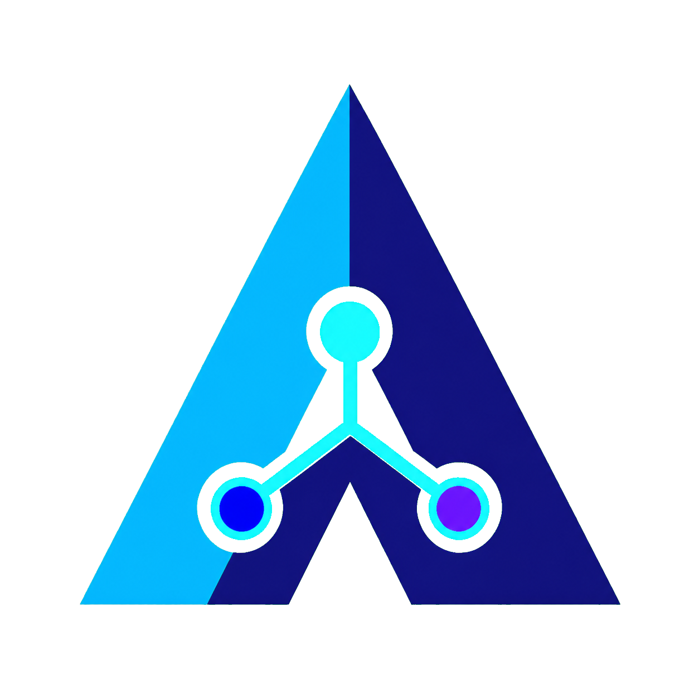

  
  <h1>AgentOS Hello</h1>
  

    <strong>Welcome screen for AgentOS written in Rust</strong>
  

  

 

  

AgentOS Hello is derived from the upstream
[CachyOS Welcome](https://github.com/CachyOS/CachyOS-Welcome) project.
